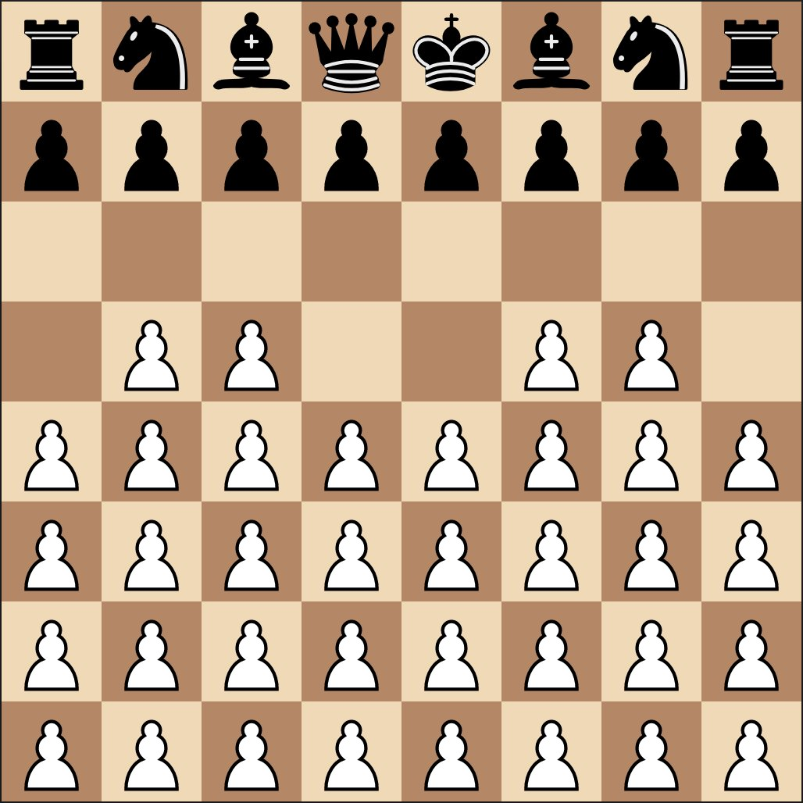
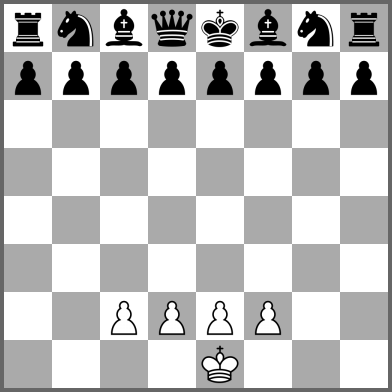
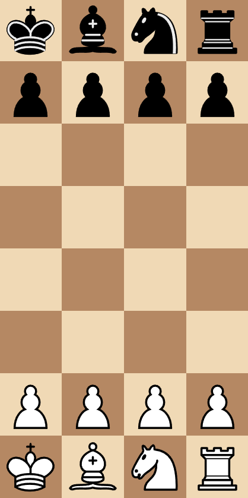

Shut Up & Sit Down – the board game reviewers – have a fun video called [_Nine Easy Ways to Make Chess Fun_](https://www.youtube.com/watch?v=8yrfLDsEcQ4) that looks at 9 variants on the rules of chess.

I've been playing normal chess a bit recently and I like it. Just going to write down notes on some of the variants that seem like they'd be fun to try out.

- [Atomic Chess](#atomic-chess)
- [Horde](#horde)
- [Monster chess](#monster-chess)
- [Rifle chess](#rifle-chess)
- [Demi chess](#demi-chess)
- [Synchronistic chess](#synchronistic-chess)
- [Get the King to the other side](#get-the-king-to-the-other-side)

## Atomic Chess

Standard chess rules and…

- Every capture causes an explosion which destroys the captured piece, the piece used to capture, and all pieces except pawns in a 3x3 square surrounding the capture piece.

- You can't capture a piece that would destroy your king.
- Your king can't capture any piece because it would be destroyed in the explosion.
- Any move that blows up the opponent's king means an immediate victory, overriding all checks and checkmates.

Normal checkmate can happen.

The two kings can touch. When the kings are touching, checks don't count because you can't capture something that would blow up your own king. To win in this situation, you have to force the king to move by zugzwang or explode a piece of the opposite colour while their king is next to it without exploding your own king

This [Lichess tutorial for Atomic chess is good](https://lichess.org/study/uf9GpQyI).

## Horde

White has 36 pawns. White wins by checkmating Black's king. Black wins by capturing all White's pawns – including pawns promoted to other pieces

White's pawns on the first and second rows can move forward 2 squares. Black's pawns can't capture White's first row pawns have moved two squares by en passant.

Read some [very in-depth strategy advice on Horde chess](https://docs.google.com/document/d/136BCRPzm1QH_OBK3qjKwlmK3MIji7ZmLZPMYgDpmOCU)

## Monster chess

White has a king and four pawns – but can move twice each turn. Black plays as usual.

Normal rules of chess but…

- White only has to escape check on the second move. It can stay in check or move into check on its first move.

- White wins by checkmating Black's king, or being able to capture Black's king on its second move.

- Black wins if the White king cannot escape check in two moves. To do that, Black has to control a 5x5 square around White's king, not just the 3x3 square as in normal chess.

## Rifle chess

Rules are the same as normal chess. But after capturing a piece, the attacker stays still. Protecting pieces is useless. I think this is going to be a brain burner.

## Demi chess

All rules the same but only four columns wide and you start with a king, bishop, knight, and rook. You castle by moving the King 2 spaces as usual.

## Synchronistic chess

Both players write down their moves and then announce them. They move pieces using these rules for resolving things.

- If both players choose to move to the same square, White captures the Black piece if it's on Black's side of the board. Black captures the White piece if it's on White's side. So you're weaker when you're closer to your home?

- If players chose to capture each other, both pieces are captured.

- If a player moves to a square that the opponent's piece moved away from in that turn, it is captured if it's of lower value (King > Queen > Castle > Bishop > Knight > Pawn). If it's the same or higher value, then pieces aren't taken.

You could both get checkmate at the same time.

## Get the King to the other side

Not sure of the name for this one but I saw it talked about in the comments. Normal rules but you can also win by getting your King into the opponent's half of the board (5th rank). You can still win by checkmate too. This probably incentivises bringing the King out earlier. Risky but could win you the game if you take the risk.
